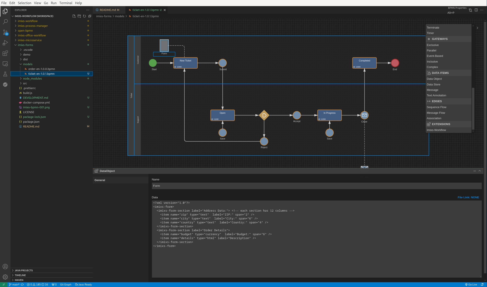

# Imixs Forms

Imixs-Forms is a lightweight, framework-agnostic form generator for building Single Page Applications with [Imixs-Workflow](https://www.imixs.org). Forms and Actions can be defined within a BPMN model and the data is automatically stored in a so called process instances within the Imixs Workflow engine.

## Overview

Imixs Forms helps developers to build custom Single Page Applications based on BPMN models. Using the [Imixs BPMN Modeler](https://www.open-bpmn.org), developers can define their workflow and form definitions directly in the BPMN model while maintaining full control over the application design and implementation. The framework provides all necessary tools for:

-   Form layouts and fields
-   Workflow states and transitions
-   Action buttons and events
-   Business logic

By combining the power of BPMN modeling with custom web development, developers can create tailored workflow applications with minimal overhead while maintaining full flexibility in their implementation.

## Features

-   Generates web forms directly from BPMN models
-   No external dependencies
-   Grid-based layout system
-   Easy integration with Imixs-Workflow
-   Extensible architecture
-   Modern error handling with user feedback
-   Automatic form state management
-   Dynamic action button generation

## Run the Demo

To run the demo application you need to run Docker. If not yet installed see the [official install guide](https://docs.docker.com/engine/install/).

Start the demo with

```
$ docker compose up
```

Open the application by defining your Model Entry Point:

```
http://localhost:8080/app/?modelversion=1.0&taskid=1000
```

## Quick Start

The following section gives you a brief overview how to integrate Imixs-Forms into your own Single-Page-Application.

1. Include the required files:

```html
<link rel="stylesheet" href="src/css/imixs-forms.css" />
<script src="./imixs-forms.min.js"></script>
```

2. Add a container element and initialize the form:

```html
<div id="form-container"></div>

<script>
    // Initialize form with default settings
    const form = new ImixsFormController("form-container");
</script>
```

3. Open the application by defining your Model Entry Point:

```
http://localhost:8080/app/?modelversion=1.0&taskid=1000
```

where `modelversion` defines your BPMN model version and `taskid` the start BPMN Task element to start with.

That's it! The form will automatically:

-   Load the BPMN model data
-   Generate the form based on your model
-   Handle form submissions
-   Manage workflow transitions

You can also overwrite the default Rest API parameters for your Imixs-Microservice:

```html
<script>
    // Or with custom configuration
    const form = new ImixsFormController("form-container", {
        baseUrl: "/api",
        credentials: {
            username: "admin",
            password: "password",
        },
    });
</script>
```

## Form Definition

Forms are defined using a simple XML format:

```xml
<?xml version="1.0"?>
<imixs-form>
  <imixs-form-section label="Address:">
    <item name="zip" type="text" label="ZIP:" span="2" />
    <item name="city" type="text" label="City:" span="6" />
  </imixs-form-section>
</imixs-form>
```

You can put in the form definition into your BPMN Model using the [Open-BPMN Modelling Tool](https://www.open-bpmn.org).



## Development

Imixs-Forms is an open source project and we welcome developers to join our community. In the section [development](./DEVELOPMENT.md) you can find information about how to get started developing and contributing to this framework.

We're particularly interested in contributions around UBL support, validation features, and performance optimizations.
